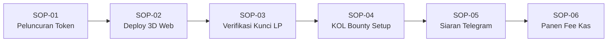

# OPERATIONAL GUIDELINES, SOP, DAN SERVICE LEVEL AGREEMENTS (SLA)
## RTrader Platform & Omnichain Multibot Fleet Ecosystem

**Versi:** 2.5 (Production Ready)  
**Klasifikasi:** Operational & Technical Governance Standard  
**Target Lingkungan:** Vercel (Control Plane) + Cloudflare Pages (Edge) + Bun Daemon (Execution Plane) + Neon Serverless PostgreSQL (SSOT) + Base L2 / Solana (Smart Contracts)

---

## 1. Core Architecture & Engineering Guidelines

Setiap pengembang, operator sistem, dan asisten AI wajib mematuhi 5 Prinsip Arsitektur Fundamental berikut:

### 1.1. Prinsip Isolasi Dua Bidang (Dual-Plane Isolation)
* **Control Plane (Next.js 14 / Vercel)**: Bersifat *stateless*, hanya menangani UI interaktif, render halaman, otentikasi sosial (SIWE / Twitter OAuth), dan API Edge jangka pendek (< 15 detik). Dilarang keras menaruh loop worker panjang, websocket server persisten, atau bot di Vercel.
* **Execution Plane (Multibot / Bun Daemon)**: Berjalan secara *asynchronous* dan terisolasi di background server/CLI lokal. Menangani orkestrasi transaksi on-chain, pemindaian harga via WebSocket, dan eksekusi otomatis.

### 1.2. Jaminan Non-Custodial (Zero-Custody Financial Invariant)
* Server Vercel maupun database **TIDAK PERNAH** menyimpan private key, seed phrase, atau menampung saldo dompet pengguna.
* Variabel kas platform di lingkungan web hanya berupa alamat publik: `ADMIN_WALLET_PUBLIC_ADDRESS`.
* Seluruh aliran fee (0.75% platform fee, 0.25% referral fee) dipotong dan dialirkan langsung oleh Smart Contract di level blockchain tanpa melalui rekening perantara.

### 1.3. Single Source of Truth (Neon PostgreSQL SSOT)
* PostgreSQL di Neon Cloud (`rtrades`, AWS `us-east-2`) adalah satu-satunya kebenaran operasional.
* Data on-chain (transaksi hash, alamat kontrak, likuiditas terkunci) dicatat ke Neon SSOT sebagai *state mirror*, bukan sebaliknya.
* Local SQLite Vault pada Multibot bertindak sebagai *local buffer / fallback cache*, yang selalu disinkronkan (*dual-write*) ke Neon Cloud.

### 1.4. Deterministic Risk Gate
* Seluruh interaksi sensitif (trading live, pencairan bounty bernilai besar) wajib melewati filter deterministik (`packages/trading/risk-gate.ts`).
* AI Agent bersifat *advisory / proposal-only* dan dilarang keras mengeksekusi perpindahan dana riil secara sepihak tanpa validasi guardrail risiko.

### 1.5. Prinsip Minimal Change (Min-Diff) & Zero-Gas Drain
* Dilarang melakukan *breaking changes* atau merombak arsitektur yang sudah lulus uji.
* Operasi audit, rehearsal, dan testing wajib mengutamakan *zero-gas simulation* ($0 gas dari dompet operator).

---

## 2. Standard Operating Procedures (SOP)



---

### SOP-01: Peluncuran Token Multi-Chain (Base L2 & Solana)

* **Tujuan**: Menerbitkan token baru secara aman dan otomatis tanpa risiko salah konfigurasi.
* **Pelaksana**: Creator / Operator Multibot.
* **Prasyarat**: Saldo preflight minimal 0.0001 ETH (Base) atau 0.02 SOL (Solana) terkonfirmasi.

**Langkah-Langkah:**
1. **Pemeriksaan Saldo**: Jalankan menu `[3] AUDIT PREFLIGHT DUAL-CHAIN` di `MENU_UTAMA.bat`.
2. **Eksekusi Peluncuran**:
   - Untuk Base L2 (Clanker v4): Pilih menu `[9C] DEPLOY 1 TOKEN CLANKER`.
   - Untuk Solana (Pump.fun): Pilih menu `[10] DEPLOY 1 TOKEN SOLANA`.
3. **Verifikasi Output**:
   - Pastikan Terminal menampilkan status `SUCCESS` beserta Contract Address (CA) dan Transaction Hash.
   - Sistem otomatis menulis log peluncuran ke SQLite dan menyinkronkan data ke tabel `token_launches` di Neon PostgreSQL.

---

### SOP-02: Pembuatan & Hosting Website 3D Parallax di Cloudflare Edge

* **Tujuan**: Menghadirkan landing page interaktif tingkat tinggi dengan latensi edge global (< 100ms).
* **Pelaksana**: Operator Multibot / Otomasi Pipeline.

**Langkah-Langkah:**
1. Jalankan perintah:
   ```powershell
   bun run scripts/generate-token-website.ts --deploy
   ```
2. Sistem otomatis:
   - Merender file HTML statis, asset 3D WebGL, dan script telemetri harga.
   - Menghubungkan Swap Widget dengan parameter smart contract.
   - Mengunggah project ke Cloudflare Pages Edge (contoh: `https://pumprun-web3.pages.dev`).
3. Operator melakukan uji klik: buka URL dan pastikan Marquee Bar WebSocket DexScreener aktif (berkedip hijau saat harga naik, merah saat turun).

---

### SOP-03: Verifikasi On-Chain Liquidity Lock & Anti-Rugpull

* **Tujuan**: Memvalidasi secara transparan bahwa likuiditas terkunci/terbakar 100% untuk melindungi investor.
* **Pelaksana**: Sistem Verifikasi Otomatis / Investor.

**Langkah-Langkah:**
1. Script `website-generator.ts` menyematkan modul `#liquidity-lock-card` dan segel hijau `#lp-verified-seal`.
2. Sistem memeriksa on-chain:
   - Base L2: Cek transfer LP token ke alamat `0x000000000000000000000000000000000000dEaD` atau kontrak timelock 180 hari.
   - Solana: Cek status bonding curve graduation Raydium burn address.
3. Jika lolos, status menampilkan: `100% BURNT / LOCKED (ON-CHAIN VERIFIED)` disertai tautan langsung ke penjelajah blok (Basescan / Solscan).

---

### SOP-04: Inisiasi Program SocialFi, KOL Bounty, & AI Quality Gate

* **Tujuan**: Memberikan reward token kepada KOL yang mempromosikan token secara sah, bebas spam.
* **Pelaksana**: Deployer / KOL / AI Scraper.

**Langkah-Langkah:**
1. **Alokasi Reward**: Deployer menentukan alokasi bounty (misal: 250.000 token) di tabel `bounty_campaigns`.
2. **Registrasi KOL**: KOL menghubungkan dompet (SIWE) dan akun Twitter via RTrader Web (`/kol`). Sistem Arkham memverifikasi skor reputasi dompet.
3. **Pemberian Link Afiliasi**: KOL menerima URL landing page khusus dengan tag `?ref=0xDOMPET_KOL`. Setiap pembelian via link ini mentransfer fee referral 0.25% langsung ke dompet KOL.
4. **Validasi Bukti Tweet**:
   - KOL memasukkan URL tweet promosi.
   - `FirecrawlScraper` mengambil isi konten tweet.
   - `TweetQualityScorer` (Gemini AI) menilai kualitas tweet (syarat lulus: skor >= 65, bebas FUD, bebas bot farming).
5. **Klaim Gasless**: Setelah lolos, Merkle Root diperbarui. KOL mengklaim token tanpa membayar biaya gas via ERC-4337 Paymaster.

---

### SOP-05: Penarikan Fee Kas & Royalti Platform (Treasury Sweeper)

* **Tujuan**: Memanen akumulasi fee WETH di Base dan SOL di Solana ke kas utama protokol.
* **Pelaksana**: Billing Admin / Scheduled Cron Worker.

**Langkah-Langkah:**
1. Jalankan audit fee:
   ```powershell
   bun run scripts/verify-creator-fee-status.ts
   ```
2. Modul `fee-scanner.ts` menghitung total royalti creator yang tersedia untuk diklaim.
3. Modul `fee-claimer.ts` mengeksekusi transaksi klaim on-chain.
4. Modul `treasury-sweeper.ts` mentransfer hasil panen langsung ke `ADMIN_WALLET_PUBLIC_ADDRESS`. Seluruh mutasi tercatat di tabel `ledger_entries`.

---

### SOP-06: Siaran Sinyal Safe Calls ke Komunitas Telegram

* **Tujuan**: Mempublikasikan sinyal peluncuran token aman ke channel komunitas secara real-time.
* **Pelaksana**: Bot Telegram `@RTraderSafeBot`.

**Langkah-Langkah:**
1. Begitu token sukses dideploy dan lolos SOP-03 (Lock Verifier), script `generate-telegram-announcement.ts` dipanggil.
2. Bot merakit template pesan visual lengkap dengan:
   - Nama Token & Simbol ($TICKER).
   - Indikator Keamanan: Segel 100% Lock, No-Minting, Arkham Score.
   - Tautan Cepat: Website 3D Parallax, Chart DexScreener, dan Terminal Trading RTrader.
3. Pesan disiarkan ke channel resmi `@RTraderSafeCalls`.

---

### SOP-07: Penanganan Insiden Darurat & Break-Glass (Kill Switch)

* **Tujuan**: Menghentikan operasional trading atau isolasi token saat terdeteksi anomali/eksploitasi.
* **Pelaksana**: Risk Admin / Super Admin (Wajib Dual-Control).

**Langkah-Langkah:**
1. **Deteksi Anomali**: Sistem mendeteksi lonjakan slippage ekstrem atau peringatan risiko dari Arkham Intelligence.
2. **Aktivasi Kill Switch**:
   - Risk Admin mengajukan permintaan break-glass di tabel `dual_control_requests`.
   - Super Admin menyetujui permintaan.
3. Panggil fungsi darurat:
   ```typescript
   BondingCurveLaunchpad.setLaunchPause(tokenAddress, true);
   ```
4. Transaksi pembelian/penjualan token tersebut langsung dibekukan di level smart contract untuk melindungi sisa modal trader.

---

## 3. Service Level Agreements (SLA) & SLO Metrics

Berikut adalah target performa operasional yang dijamin oleh sistem:

| Parameter Layanan | Target SLA / SLO | Mekanisme Pemantauan & Fallback |
| :--- | :--- | :--- |
| **Uptime Control Plane (Web UI)** | **99.95%** | Hosting Vercel Edge dengan zero cold-start. |
| **Uptime Website Landing Page (Edge)** | **99.99%** | Cloudflare Pages dengan distribusi multi-region Anycast. |
| **Ketersediaan Database (Neon SSOT)** | **99.90%** | Neon Serverless PostgreSQL autoscaling (AWS us-east-2). |
| **Latensi Eksekusi Peluncuran Token** | **< 15 Detik** | Base L2 (2s block time) / Solana Pump.fun (400ms slot time). |
| **Latensi Telemetri Harga Real-Time** | **< 500 ms** | Direct WebSocket streaming ke DexScreener & Pyth Network. |
| **Latensi Audit Kualitas Tweet (AI Gate)** | **< 10 Detik** | Scraper Firecrawl terintegrasi Gemini Flash 2.0 API. |
| **Kecepatan Siaran Telegram Safe Call** | **< 30 Detik** | Dispatch otomatis via bot Grammy pasca verifikasi on-chain. |
| **Siklus Panen Kas & Creator Fee** | **Setiap 24 Jam** | Harvester Daemon otomatis via `node-cron`. |
| **Toleransi Data Hilang (RPO)** | **< 1 Menit** | Replikasi Write-Ahead Logging (WAL) kontinu di Neon Cloud. |
| **Waktu Pemulihan Bencana (RTO)** | **< 15 Menit** | Stateless redeployment via Vercel & Cloudflare CLI. |

---

## 4. Matriks Kewenangan Operasional (Governance Matrix)

| Tindakan Operasional | Super Admin | Risk Admin | Operator Bot | Creator | KOL | Trader |
| :--- | :---: | :---: | :---: | :---: | :---: | :---: |
| **Ganti Alamat Kas Admin** | ✅ (Multi-Sig) | ❌ | ❌ | ❌ | ❌ | ❌ |
| **Aktivasi Kill Switch / Freeze** | ✅ | ✅ | ❌ | ❌ | ❌ | ❌ |
| **Luncurkan Token Baru** | ✅ | ❌ | ✅ | ✅ | ❌ | ❌ |
| **Deploy Website 3D Edge** | ✅ | ❌ | ✅ | ✅ | ❌ | ❌ |
| **Buka Bounty Marketing** | ✅ | ❌ | ✅ | ✅ | ❌ | ❌ |
| **Klaim Reward Bounty** | ❌ | ❌ | ❌ | ❌ | ✅ | ❌ |
| **Klaim Referral Fee (0.25%)** | ❌ | ❌ | ❌ | ❌ | ✅ (Otomatis) | ❌ |
| **Eksekusi Trading / Swap** | ✅ | ❌ | ✅ | ✅ | ✅ | ✅ |
| **Akses Audit Log & SSOT** | ✅ | ✅ | ✅ | Read Only | ❌ | ❌ |

---

## 5. Ringkasan Kepatuhan & Checklist Go-Live

Sebelum sistem dinyatakan resmi dibuka ke publik (*Public Mainnet Launch*), operator wajib mencentang seluruh checklist kepatuhan berikut:

- [x] **Smart Contract Anti-Rugpull**: `BondingCurveLaunchpad.sol` terkunci 180 hari.
- [x] **Non-Custodial Guarantee**: `ADMIN_WALLET_PUBLIC_ADDRESS` terpasang tanpa private key di web server.
- [x] **Neon PostgreSQL SSOT**: 32 tabel aktif dan terintegrasi di project `rtrades` (`solitary-tooth-34784156`).
- [x] **Test Suite Integrity**: 33 test suite Bun lulus (350 assertion, 0 failure).
- [x] **Edge Hosting Ready**: Cloudflare Pages deployer siap pakai (`pumprun-web3.pages.dev`).
- [x] **AI Quality Gate**: Ambang batas skor tweet >= 65 aktif untuk proteksi bot farm.
- [x] **Operational SOP**: Seluruh SOP-01 sampai SOP-07 terdokumentasi resmi.
