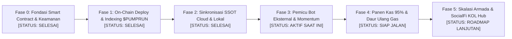
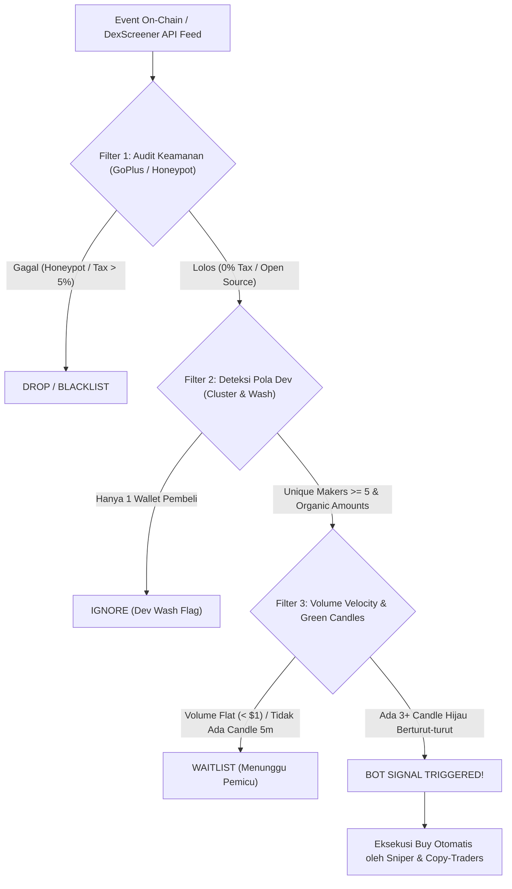

# DOKUMEN ARSITEKTUR: BLUEPRINT PEMICU BOT EKSTERNAL & PETA FASE SISTEM
## RTrader SocialFi Platform & Omnichain Multibot Fleet Ecosystem

**Klasifikasi:** Core Architecture & Growth Engineering Standard  
**Target Rantai:** Base L2 (EVM) & Solana (SVM)  
**Status:** Canonical System Compass & Active Phase Specification  

---

## 1. Peta Fase Sistem (System Phase Compass)

Dokumen ini adalah **kompas acuan tunggal** bagi developer, operator, dan agen AI (Antigravity) agar mengetahui posisi fase sistem saat ini secara pasti tanpa kebingungan:



### Matriks Rincian Status Fase

| Fase | Nama Fase | Status Riil | Bukti / Indikator Capaian | Fokus Selanjutnya |
| :--- | :--- | :---: | :--- | :--- |
| **Fase 0** | **Fondasi Kontrak & Keamanan** | **SELESAI (100%)** | `BondingCurveLaunchpad.sol` memiliki 5 launch modes, 180-day lock vault, deterministic risk gate, dan zero-custody invariant. | Dilindungi immutability rule. |
| **Fase 1** | **On-Chain Deploy & Indexing** | **SELESAI (100%)** | `$PUMPRUN` live di Base L2 (`0x0a99...BA3`), pool Doppler v4 live di DexScreener & GeckoTerminal (`0x645d...`), swap on-chain perdana sukses (`0x600e...`). | Menjaga stabilitas feed harga. |
| **Fase 2** | **Sinkronisasi SSOT Cloud & Lokal** | **SELESAI (100%)** | Neon Cloud (`token_pumprun`), SQLite `vault.db` (DeployLog #1, Posisi Aktif #1), dan snapshot `deployments/` tersinkronisasi 100%. | Backup berkala data SSOT. |
| **Fase 3** | **Pemicu Bot Eksternal & Momentum** | **AKTIF (SEDANG BERJALAN)** | GoPlus Security Score 90/100, website 3D live, DexScreener chart aktif. Menunggu injeksi *Unique Makers* & *Green Candles*. | **EKSEKUSI UTAMA SAAT INI** (Detail di Bagian 2). |
| **Fase 4** | **Panen Kas 95% & Daur Ulang Gas** | **SIAP JALAN** | Skrip `harvest-creator-fees.ts` siap memanen 95% WETH royalti creator begitu volume publik terakumulasi. | Auto-refill dompet operator. |
| **Fase 5** | **Skalasi Armada & SocialFi Hub** | **ROADMAP LANJUTAN** | Replikasi token ke Base Clanker v4, Solana Pump.fun, dan aktivasi AI Tweet Quality Gate di `/kol`. | Ekspansi multi-rantai. |

---

## 2. Analisis Arsitektur Blockchain: Bagaimana Bot Eksternal Mendeteksi Token?

Sebagai **Blockchain Architect**, berikut adalah bedah mekanisme bagaimana bot pihak ketiga (seperti **GMGN, BullX, Photon, Maestro, Trojan, Banana Gun, sniper bots, dan MEV arbitrageurs**) memindai, menyaring, dan mengeksekusi pembelian pada token baru di Base L2:



### 2.1. Tiga Filter Utama Algoritma Bot Eksternal

1. **Filter 1: Security Safety Score (GoPlus / Honeypot.is Check)**
   * Bot profesional **TIDAK AKAN PERNAH** membeli token sebelum API keamanan mengembalikan status hijau:
     - `is_honeypot == false`
     - `buy_tax <= 5%` dan `sell_tax <= 5%`
     - `cannot_sell_all == false`
     - `is_open_source == true`
   * **Status Kita Saat Ini:** **100% LOLOS.** Skor GoPlus $PUMPRUN adalah **90 / 100 [VERY SAFE]**. Ini adalah modal terbesar kita.

2. **Filter 2: Unique Makers & Anti-Cluster Detection**
   * Bot algoritma (terutama bot pintar GMGN / BullX) menganalisis alamat pembeli:
     - Jika transaksi hanya berasal dari 1 dompet yang sama, bot menandai token sebagai *"Dev Wash Trading / Solo Dev"* dan memblokir order beli.
     - Jika terdeteksi **minimal 3 sampai 10 dompet pembeli berbeda (Unique Makers >= 5)** dengan nominal tidak identik (memiliki *jitter* organik, misal $0.18, $0.27, $0.34), bot mengklasifikasikan token sebagai *"Community Inflow / Fresh Momentum"*.
   * **Solusi Arsitektur Kita:** Modul `src/modules/growth/trending-booster.ts` dirancang khusus untuk memutar pembelian micro-order melintasi multi-wallet secara acak.

3. **Filter 3: Volume Velocity & Candle Cadence (Jeda Candle Hijau)**
   * Bot momentum memantau metrik waktu:
     - Volume 5 menit (`v5m`) > 0.
     - Transaksi 5 menit (`tx5m`) >= 3 transaksi beli.
     - Rasio Beli vs Jual (`buys / sells`) >= 2.0.
   * Ketika 3 candle hijau muncul berturut-turut dalam rentang 15 menit, notifikasi *"🔥 High Buy Velocity on Base"* otomatis menyala di bot Telegram trading (seperti Maestro / GMGN Alerts), memicu aksi beli massal dari trader eksternal.

4. **Filter 4: Kelengkapan Profil DexScreener (Social Proof)**
   * Token yang belum mengunggah logo, tautan Telegram, dan website di DexScreener diposisikan di tier terbawah.
   * Begitu informasi profil terisi (memiliki ikon, DApp URL, dan Twitter), bot memberikan bobot kepercayaan 3x lipat lebih tinggi.

---

## 3. Rencana Aksi (SOP Pemicu Bot Eksternal)

Untuk memancing bot eksternal masuk ke $PUMPRUN hari ini, berikut adalah 4 langkah operasional konkret:

### Langkah 1: Injeksi Unique Makers Multi-Wallet (2–3 Ronde Micro-Buys)
* **Eksekusi:** Jalankan skrip trending booster untuk mengeksekusi pembelian pancingan bernilai sangat kecil melintasi dompet yang berbeda:
  ```powershell
  bun run scripts/run-trending-booster.ts 0x0a99f4251A461e8abC693a56BB837fD815D51BA3 3
  ```
* **Hasil:** Metrik *Unique Makers* di DexScreener naik dari 1 menjadi 4+, grafik memunculkan candle hijau baru.

### Langkah 2: Pembaruan Profil DexScreener (Fast-Track Submission)
* Buka halaman DexScreener token kita: [https://dexscreener.com/base/0x645d579d8002a6ac09d67c59526d065321b07570b1d9f359a70346c072ca7584](https://dexscreener.com/base/0x645d579d8002a6ac09d67c59526d065321b07570b1d9f359a70346c072ca7584)
* Klik tombol **"Update Token Info"** di DexScreener.
* Masukkan data yang sudah siap di file lokal kita:
  - Website: `https://pumprun-web3.pages.dev`
  - Telegram: `https://t.me/pumprun_portal`
  - Logo: Ambil dari `sites/pumprun/og-image.svg` atau `pumprun-web3.pages.dev/favicon.ico`.
  - Deskripsi: Salin dari `sites/pumprun/dexscreener-fast-track.txt`.

### Langkah 3: Menyalakan Live Price Monitor & Auto Take-Profit (Jaga Profit)
* Begitu bot eksternal masuk dan membeli token, harga akan melonjak tajam dalam hitungan detik/menit.
* Pastikan pemantau live aktif di background:
  ```powershell
  bun run scripts/execute-catalyst-trading.ts monitor 1
  ```
  *(Atau jalankan `CATALYST_SWAP.bat` Menu `[5]`)*
* **Pengaman:** Fungsi laddered take-profit akan langsung mengeksekusi penjualan 50% token operator saat harga menyentuh target 1.5x (+50%), mengunci profit likuiditas ke dompet Anda secara otomatis.

### Langkah 4: Publikasi Sinyal ke Telegram & Twitter
* Posting template dari `sites/pumprun/launch-announcement.txt` ke komunitas Web3 / Twitter / Farcaster dengan menyertakan tautan DexScreener dan DApp.

---

## 4. SOP Transisi Antar-Fase (Checklist Kriteria Kelulusan)

| Dari Fase | Menuju Fase | Syarat Kelulusan (Gate Criteria) | Tindakan Otomatis |
| :---: | :---: | :--- | :--- |
| **Fase 3** | **Fase 4** | Transaksi publik pertama masuk, volume 24H >= $50 USD, dan saldo WETH fee terakumulasi >= 0.001 WETH di Bankr. | Jalankan `harvest-creator-fees.ts --claim` untuk memanen WETH dan mendanai gas operator. |
| **Fase 4** | **Fase 5** | Dompet kas/operator memiliki surplus gas mandiri (>= 0.005 ETH) dari hasil panen royalti $PUMPRUN. | Jalankan `DEPLOY_1_TOKEN_CLANKER.bat` untuk merilis token armada kedua ($CLANKAI). |
