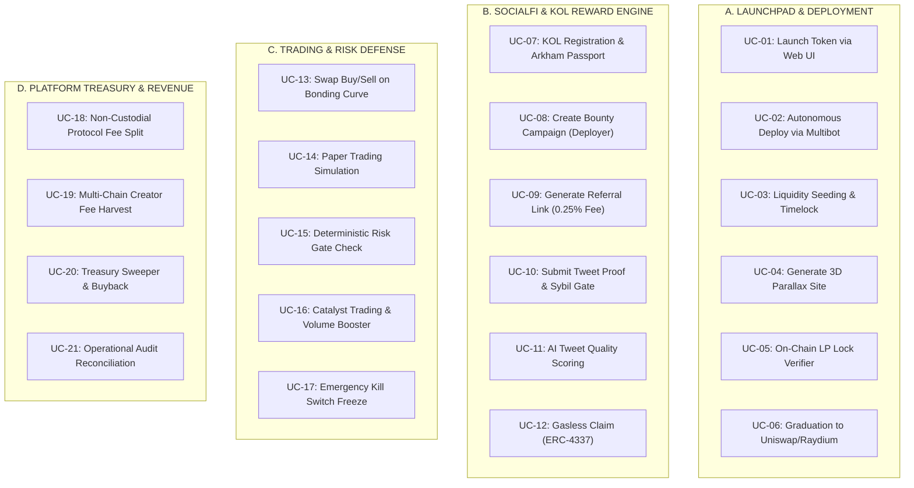
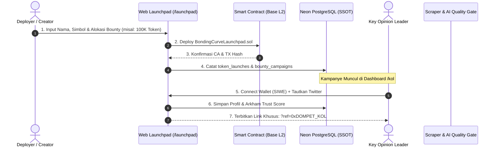
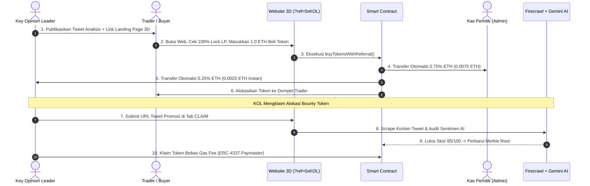
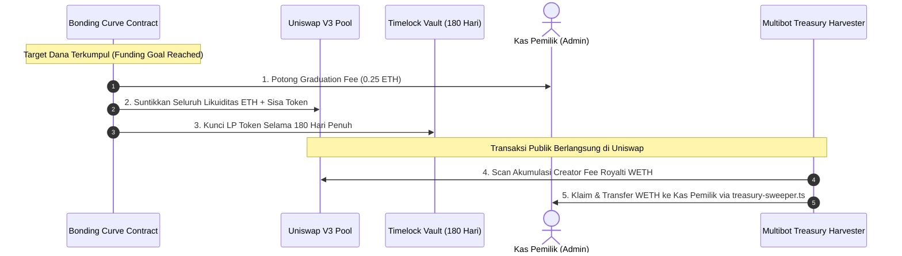

# SPESIFIKASI USE CASE, MATRIKS RBAC, DAN WORKFLOW INTERAKSI
## Platform RTrader Degen Launchpad, SocialFi Hub & Multibot Fleet

**Versi Dokumen:** 2.5 (Production Specification)  
**Status:** Canonical Behavioral Contract  
**Arsitektur:** Non-Custodial EVM (Base L2) + Solana + Next.js 14 Web Control Plane + Bun Execution Daemon + Neon Serverless PostgreSQL SSOT

---

## 1. Katalog Aktor & Persona Sistem

| ID Aktor | Nama Persona | Deskripsi & Hak Akses Utama |
| :--- | :--- | :--- |
| **ACT-01** | **SUPER_ADMIN** (Pemilik Platform) | Pemilik protokol / Multi-Sig. Memegang hak veto darurat, pengatur alamat kas admin (`ADMIN_WALLET_PUBLIC_ADDRESS`), pengubah parameter global. |
| **ACT-02** | **RISK_ADMIN** (Security Officer) | Penjaga gerbang risiko deterministik, pemantau anomali dompet (Arkham), eksekutor pembekuan token bermasalah (*Dual-Control*). |
| **ACT-03** | **OPERATOR** (Multibot Controller) | Operator armada bot lokal/daemon. Menjalankan deployer multi-chain, generator web 3D, dan skrip panen fee kas. |
| **ACT-04** | **DEPLOYER / CREATOR** (Pembuat Token) | Pengguna publik atau developer yang meluncurkan token via web launchpad atau CLI, serta penyedia dana kampanye *bounty* KOL. |
| **ACT-05** | **KOL / AFFILIATE** (Influencer Web3) | Promotor terverifikasi (X/Twitter, Farcaster). Membagikan link referral, mengklaim bounty via bukti tweet, dan menerima komisi on-chain. |
| **ACT-06** | **TRADER / INVESTOR** (Pembeli Token) | Trader publik (degen/investor). Membeli dan menjual token di kurva *bonding curve*, memverifikasi keamanan token via Nutrition Label. |
| **ACT-07** | **AUTOMATED_AGENT** (Sistem AI & Keeper) | Scraper bukti tweet (Firecrawl), penilai sentimen AI (Gemini Flash), Chainlink Automation Keeper, dan ERC-4337 Gasless Paymaster. |

---

## 2. Katalog Lengkap Use Case (UC-01 s/d UC-21)

### Rincian Spesifikasi Use Case:

#### Kategori A: Launchpad & Token Creation
* **UC-01: Meluncurkan Token via Web UI (Deployer)**
  * *Aktor*: DEPLOYER (`ACT-04`).
  * *Alur*: Deployer menghubungkan dompet (MetaMask/Rabby), mengisi nama, simbol, kurva *bonding curve*, dan alokasi creator di `/launchpad`. Smart contract mencetak token di Base L2. Data otomatis masuk ke tabel `token_launches` di Neon SSOT.
* **UC-02: Meluncurkan Token via Multibot CLI (Operator)**
  * *Aktor*: OPERATOR (`ACT-03`).
  * *Alur*: Operator memilih menu `[9C]` (Base Clanker) atau `[10]` (Solana Pump.fun) di `MENU_UTAMA.bat`. Bot memeriksa saldo preflight, mengeksekusi peluncuran, dan mencatat hash transaksi ke Neon DB.
* **UC-03: Penguncian Likuiditas Otomatis 180 Hari**
  * *Aktor*: AUTOMATED_AGENT (`ACT-07`).
  * *Alur*: Smart contract `BondingCurveLaunchpad.sol` mengunci LP token ke vault kontrak dengan aturan mutlak `MIN_LOCK_DURATION = 180 days` untuk mencegah rugpull.
* **UC-04: Pembuatan & Hosting Landing Page 3D Parallax**
  * *Aktor*: OPERATOR / AUTOMATED_AGENT (`ACT-03`, `ACT-07`).
  * *Alur*: Script `generate-token-website.ts` merender HTML statis 3D WebGL, memasang telemetri WebSocket DexScreener, dan mengunggahnya ke Cloudflare Pages (`*.pages.dev`).
* **UC-05: Verifikasi Status Likuiditas On-Chain**
  * *Aktor*: TRADER (`ACT-06`).
  * *Alur*: Trader membuka website token, melihat kartu `#liquidity-lock-card` dan lencana hijau `100% BURNT / LOCKED (ON-CHAIN VERIFIED)` yang terhubung langsung ke penjelajah blok.
* **UC-06: Kelulusan Token (*Graduation*) ke DEX Resmi**
  * *Aktor*: AUTOMATED_AGENT (`ACT-07`).
  * *Alur*: Saat target market cap *bonding curve* tercapai, kontrak menutup kurva, memotong graduation fee ke kas platform, dan memigrasikan seluruh likuiditas ke Uniswap V3 (Base) atau Raydium (Solana).

#### Kategori B: SocialFi & KOL Reward Engine
* **UC-07: Registrasi Paspor Reputasi KOL**
  * *Aktor*: KOL (`ACT-05`).
  * *Alur*: KOL menghubungkan dompet (SIWE) dan akun Twitter di `/kol`. Sistem memeriksa reputasi dompet via Arkham Intelligence dan menerbitkan lencana reputasi (Bronze, Silver, Gold).
* **UC-08: Pembukaan Kampanye Bounty Marketing (Deployer)**
  * *Aktor*: DEPLOYER (`ACT-04`).
  * *Alur*: Deployer membuka tab `CREATOR` di `/kol`, memasukkan alokasi token hadiah (misal 50.000 token), menentukan hashtag wajib (`#TOKEN`), dan batas minimal followers KOL. Data dicatat di tabel `bounty_campaigns`.
* **UC-09: Pengambilan Link Referral & Pembagian Fee On-Chain (0.25%)**
  * *Aktor*: KOL (`ACT-05`) & TRADER (`ACT-06`).
  * *Alur*: KOL mendapatkan link `?ref=0xDOMPET_KOL`. Ketika trader membeli token melalui link ini, fungsi `buyTokensWithReferral()` langsung mentransfer fee komisi 0.25% ke dompet KOL seketika di blockchain.
* **UC-10: Pengajuan Bukti Tweet Promosi & Filter Sybil**
  * *Aktor*: KOL (`ACT-05`).
  * *Alur*: KOL memasukkan URL tweet bukti promosi di tab `CLAIM`. Sistem memverifikasi Proof-of-Humanity (Gitcoin Passport / WorldID ZK-proof) untuk memastikan KOL bukan akun bot farm.
* **UC-11: Audit Kualitas Tweet Otomatis oleh AI**
  * *Aktor*: AUTOMATED_AGENT (`ACT-07`).
  * *Alur*: Firecrawl men-scrape teks tweet, lalu model Gemini AI menilai bobot konten. Tweet yang memiliki hashtag sesuai, sentimen non-negatif, dan skor kualitas >= 65 dinyatakan **VERIFIED**.
* **UC-12: Pencairan Hadiah Token Bebas Gas Fee (*Gasless Claim*)**
  * *Aktor*: KOL (`ACT-05`) & AUTOMATED_AGENT (`ACT-07`).
  * *Alur*: Kontrak memperbarui Merkle Root. KOL mengklaim token hadiah via ERC-4337 Paymaster tanpa perlu mengeluarkan saldo gas ETH sama sekali.

#### Kategori C: Trading & Proteksi Risiko
* **UC-13: Pembelian & Penjualan Token di Kurva Bonding Curve**
  * *Aktor*: TRADER (`ACT-06`).
  * *Alur*: Trader memilih token, memasukkan nominal swap di terminal trading atau website 3D, dan menandatangani transaksi di browser.
* **UC-14: Simulasi Trading Tanpa Modal (*Paper Trading*)**
  * *Aktor*: TRADER (`ACT-06`).
  * *Alur*: Trader memilih mode `PAPER` di `/trading` untuk menguji strategi tanpa menggunakan uang riil. Transaksi disimulasikan di database tanpa mengeksekusi on-chain.
* **UC-15: Evaluasi Deterministik Risk Gate**
  * *Aktor*: AUTOMATED_AGENT (`ACT-07`).
  * *Alur*: Setiap order live diperiksa oleh `TradingRiskGate`: batas order maksimal, batas slippage (< 2%), dan verifikasi tidak adanya *kill switch* aktif.
* **UC-16: Penguatan Likuiditas Pasar (*Catalyst Trading*)**
  * *Aktor*: OPERATOR (`ACT-03`).
  * *Alur*: Operator menjalankan modul Catalyst Multibot untuk mengeksekusi swap mikro ($1) guna memancing charting di DexScreener dan mengaktifkan grafik volume.
* **UC-17: Pembekuan Darurat Token (*Kill Switch Break-Glass*)**
  * *Aktor*: RISK_ADMIN (`ACT-02`) & SUPER_ADMIN (`ACT-01`).
  * *Alur*: Jika terdeteksi eksploitasi, Risk Admin mengajukan pembekuan di tabel `dual_control_requests`. Setelah disetujui Super Admin, fungsi `setLaunchPause(tokenAddress, true)` menghentikan trading token seketika.

#### Kategori D: Kas Platform & Pendapatan Protokol
* **UC-18: Pemisahan Fee Protokol Otomatis (0.75% Net)**
  * *Aktor*: AUTOMATED_AGENT (`ACT-07`).
  * *Alur*: Pada setiap transaksi beli/jual di smart contract, 0.75% ditransfer langsung ke `ADMIN_WALLET_PUBLIC_ADDRESS`.
* **UC-19: Pemindaian & Klaim Royalti Creator Multi-Chain**
  * *Aktor*: OPERATOR / AUTOMATED_AGENT (`ACT-03`, `ACT-07`).
  * *Alur*: Modul `fee-scanner.ts` dan `fee-claimer.ts` mendeteksi akumulasi WETH royalti Clanker di Base L2 dan mengeksekusi penarikan on-chain.
* **UC-20: Penyapuan Kas & Flywheel Auto-Burn**
  * *Aktor*: OPERATOR (`ACT-03`).
  * *Alur*: Modul `treasury-sweeper.ts` menyapu saldo kas, memutar sebagian untuk buyback & burn token komunitas, dan menyetorkan sisanya ke cold wallet pemilik.
* **UC-21: Rekonsiliasi Audit & Laporan SSOT**
  * *Aktor*: SUPER_ADMIN / RISK_ADMIN (`ACT-01`, `ACT-02`).
  * *Alur*: Sistem mencocokkan saldo on-chain blockchain dengan tabel `ledger_entries` di Neon PostgreSQL untuk menjamin integritas 100% tanpa selisih.

---

## 3. Matriks Lengkap RBAC (16 Kapabilitas x 7 Aktor)

| ID | Kapabilitas Sistem | SUPER_ADMIN | RISK_ADMIN | OPERATOR | DEPLOYER | KOL | TRADER | AI_AGENT |
| :---: | :--- | :---: | :---: | :---: | :---: | :---: | :---: | :---: |
| **CAP-01** | `VIEW_TOKENS_AND_CHARTS` | ✅ | ✅ | ✅ | ✅ | ✅ | ✅ | ✅ |
| **CAP-02** | `CONNECT_WALLET_SIWE` | ✅ | ✅ | ✅ | ✅ | ✅ | ✅ | ❌ |
| **CAP-03** | `CREATE_LAUNCH_DRAFT` | ✅ | ❌ | ✅ | ✅ | ❌ | ❌ | ❌ |
| **CAP-04** | `DEPLOY_SMART_CONTRACT` | ✅ | ❌ | ✅ | ✅ | ❌ | ❌ | ❌ |
| **CAP-05** | `HOST_3D_PARALLAX_SITE` | ✅ | ❌ | ✅ | ✅ | ❌ | ❌ | ✅ |
| **CAP-06** | `CREATE_BOUNTY_CAMPAIGN` | ✅ | ❌ | ✅ | ✅ | ❌ | ❌ | ❌ |
| **CAP-07** | `GENERATE_REFERRAL_TAG` | ❌ | ❌ | ❌ | ❌ | ✅ | ❌ | ❌ |
| **CAP-08** | `SUBMIT_TWEET_PROOF` | ❌ | ❌ | ❌ | ❌ | ✅ | ❌ | ❌ |
| **CAP-09** | `AUDIT_TWEET_QUALITY_AI` | ❌ | ❌ | ❌ | ❌ | ❌ | ❌ | ✅ |
| **CAP-10** | `CLAIM_GASLESS_REWARD` | ❌ | ❌ | ❌ | ❌ | ✅ | ❌ | ❌ |
| **CAP-11** | `TRADE_ON_BONDING_CURVE` | ✅ | ❌ | ✅ | ✅ | ✅ | ✅ | ❌ |
| **CAP-12** | `PAPER_TRADING_SANDBOX` | ✅ | ✅ | ✅ | ✅ | ✅ | ✅ | ❌ |
| **CAP-13** | `TRIGGER_CATALYST_SWAP` | ✅ | ❌ | ✅ | ❌ | ❌ | ❌ | ❌ |
| **CAP-14** | `ACTIVATE_KILL_SWITCH` | ✅ (Dual) | ✅ (Dual) | ❌ | ❌ | ❌ | ❌ | ❌ |
| **CAP-15** | `CLAIM_CREATOR_FEES` | ✅ | ❌ | ✅ | ❌ | ❌ | ❌ | ❌ |
| **CAP-16** | `UPDATE_ADMIN_WALLET` | ✅ (MultiSig)| ❌ | ❌ | ❌ | ❌ | ❌ | ❌ |

> [!IMPORTANT]
> **Dual-Control Break-Glass Invariant**: Kapabilitas `ACTIVATE_KILL_SWITCH` dan `OVERRIDE_RISK_ENGINE` memerlukan persetujuan ganda (*dual approval*) antara `RISK_ADMIN` dan `SUPER_ADMIN` yang dicatat di tabel `dual_control_requests` sebelum fungsi smart contract dieksekusi.

---

## 4. Diagram Alur Kerja & Interaksi Antar-Aktor (Workflows)

### Alur Kerja 1: Peluncuran Token & Perekrutan Pasukan KOL

---

### Alur Kerja 2: Promosi Viral, Bagi Hasil Instan & Klaim Gasless

---

### Alur Kerja 3: Kelulusan Token (Graduation) & Penarikan Royalti Kas

---

## 5. Ringkasan Kunci Bagi Pemilik Platform

1. **Self-Sustaining Ecosystem**: Deployer mendapatkan panggung peluncuran instan, KOL mendapatkan komisi uang tunai instan + token gratis, trader mendapatkan token anti-rugpull dengan likuiditas terkunci, dan **Anda (Pemilik) mendapatkan aliran fee 0.75% + graduation fee + royalti WETH secara otomatis**.
2. **Kepatuhan Mutlak**: Seluruh interaksi di atas telah dipetakan 1-ke-1 dengan smart contract yang sudah dikompilasi, skema 32 tabel Neon PostgreSQL yang sudah live, dan modul UI yang sudah ada di repositori.
